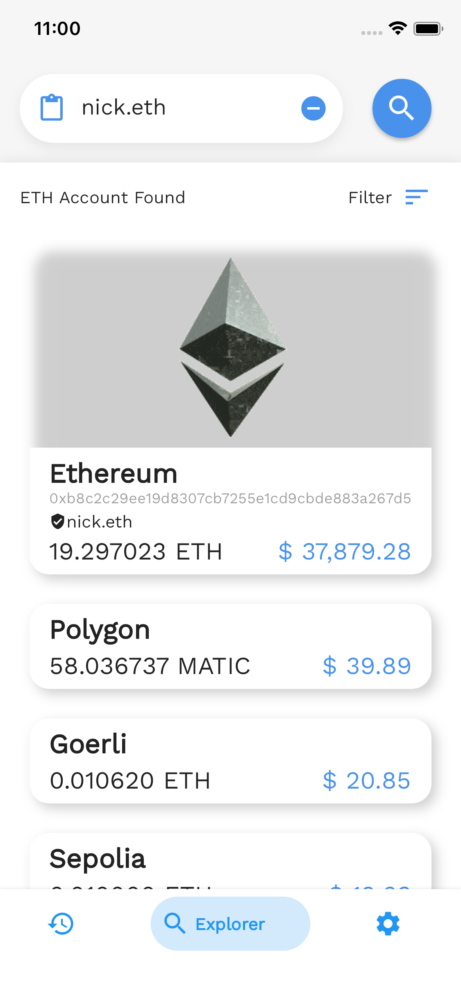
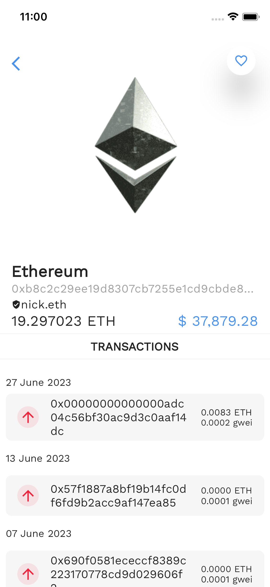
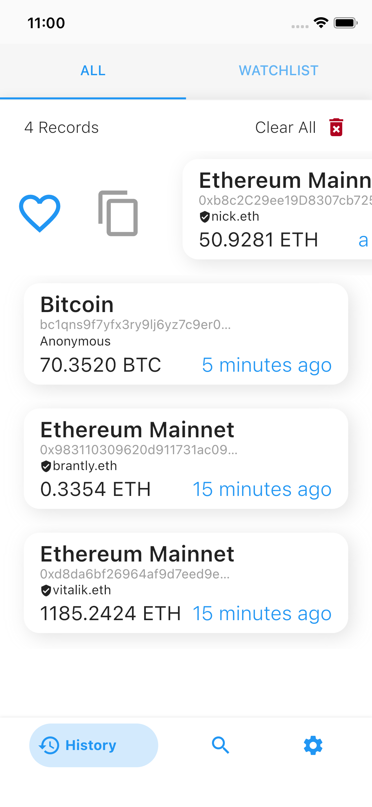
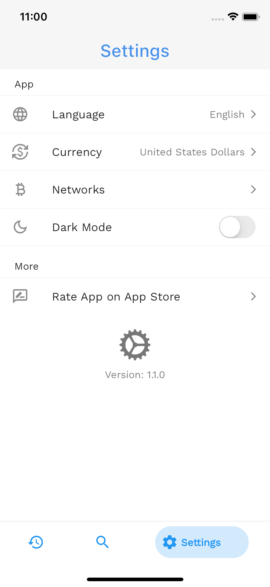

# DeFi Scan
This is the official repository for DeFi Scan - a mobile blockchain explorer built with Dart/Flutter for searching, curating and storing details of cryptocurrency accounts.

## Get it on
<!--    -->

You can also try out a web demo on my flutter portfolio page [DeFi Scan](https://flutter.bisi.dev).

<!-- ## In App Preview -->

## In App Screenshots
   

---

## Development - Mini Documentation

### VERSIONING
- Dart: >= 3.0.0 < 4.0.0
- Flutter: Flutter 3.10.3
- State Management: BLOC 8.1.0
- Other Packages : [List](pubspec.yaml)

### STRUCTURE
This project currently implements a Dev Feature-First File Structure.
  Data Sources (DB) : Infura and MaticVigil Blockchain nodes

## CI/CD
This repository utilizes Continuous Integration against all pushes made to the main branch.
 
All APKs can be found as artifacts in the GitHub Actions TAB.
 
CI / CD tool: Github Actions
 
Builds/Releases: [APK artifacts](https://github.com/bisi-dev/defiscan/actions/workflows/flutter-ci.yml)

---

## Development - Contribution
You can contribute by reporting bugs, suggesting improvements, and/or by helping out in code.
UI/UX designers are always welcome. I always appreciate feedback, so share your thoughts and suggestions with me: [mail@bisi.dev](mailto:yinka.olabisi@yahoo.com).
1. Feel free to fork this repo and help out
2. Make small, concise, and well documented commits.
3. No idea where to start? Contact me and we can discuss appropriate tasks.

### Getting Started
Check out [Flutter's official guide](https://flutter.dev/docs/get-started/install) to installing and running Flutter on your system.

### Prerequisites
- Download IDE either [Android Studio](https://developer.android.com/studio) or [VSC](https://code.visualstudio.com/)
- Install Flutter SDK and Dart plugin.
- Flutter stable channel is used for development.
- Mobile device (emulator or physical).

### Steps
- Clone this repo to your local machine: `git clone https://github.com/bisi-dev/defiscan.git`
- Run `flutter run pub get` in terminal inside project root directory.
- Run `flutter packages pub run build_runner build --delete-conflicting-outputs` to generate storage adapters.
- Run `main.dart` on emulator or physical device.
- All set!

### License
This project is licensed under [Apache-2.0 License](https://opensource.org/licenses/Apache-2.0). It means you're free to use, copy, modify, merge, publish, distribute, sublicense, and/or sell this project.

#### Thank You
Wow, Thank you for visiting this page. I appreciate the time you took to read through this. I would extra love if you could promote the app on social media or be kind enough to leave a star 🙏

Thanks a lot! 💪
Ayodeji Olabisi – [bisi.dev](https://bisi.dev)
